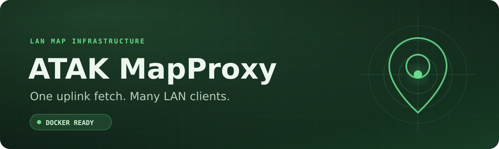
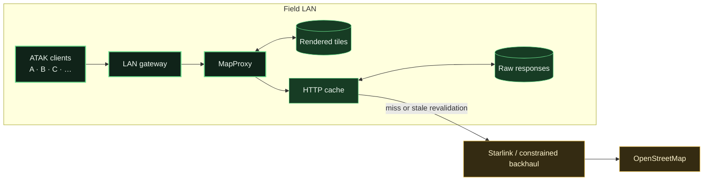

<div align="center">
  

  <p>
    
    
    
  </p>

  <p><strong>A shared OpenStreetMap cache for field networks.</strong></p>
  <p>Built for Starlink, satellite backhaul, incident networks, and other constrained connections.</p>
</div>

---

## Why run it locally?

When several field devices view the same area, they should not each download
the same map tiles across the uplink.

- The first request for a missing tile retrieves it upstream.
- MapProxy stores the result on the Docker host.
- Later requests reuse the LAN cache.
- Stale tiles are revalidated only when somebody views them again.



The cache is demand-driven. It does not pre-seed or create offline archives
from the public OSM tile service.

## Quick start

Install [Docker](https://docs.docker.com/get-started/get-docker/), Git, `curl`,
`jq`, and `ripgrep`. Then clone or download this repository and enter its
directory:

```bash
git clone YOUR_REPOSITORY_URL mapproxy-atak
cd mapproxy-atak
```

Copy `YOUR_REPOSITORY_URL` from the repository's **Code** button.

### Windows with WSL

Find the Windows LAN address with `ipconfig.exe`. Use the IPv4 address under the
active Wi-Fi or Ethernet adapter—not the private WSL address.

```bash
make windows-up HOST=192.168.1.50 CONTACT=https://maps.example.org/contact
```

The Windows command installs a local Caddy forwarder. This preserves real LAN
client addresses that Docker Desktop would otherwise replace with a bridge
address.

### Native Linux or direct Docker

Find the host's LAN address with `ip -4 address`, then run:

```bash
make configure HOST=192.168.1.50 CONTACT=https://maps.example.org/contact
make up
```

Replace the example address and contact URL. When using the public OSM tile
service, the contact should be an operator-controlled, monitored HTTPS page.

For complete Windows, Linux, macOS, firewall, and troubleshooting instructions,
read the [Docker and network guide](docs/DOCKER.md).

## Add the map to ATAK

On the ATAK device, open the install page:

```text
http://192.168.1.50:8080/
```

Then choose one method:

1. Tap **Add to ATAK**.
2. Download and import the XML.
3. Display the page on another screen and scan its QR code.

Select **OSM Standard — © OpenStreetMap contributors (Local MapProxy)** in the
map or imagery selector.

The XML and QR code are generated for the deployment under ignored `runtime/`.
They are never committed to the repository.

## Operations dashboard

Monitoring is optional. Start it when you need an event-operations wallboard:

```bash
make monitoring-up
```

Open [http://127.0.0.1:3000/d/mapproxy-operations](http://127.0.0.1:3000/d/mapproxy-operations).

The Grafana dashboard is organized into seven sections:

- live 10-second demand;
- five-minute efficiency;
- LAN and upstream payload;
- latency and reliability;
- cache behavior;
- client and map demand; and
- errors and slow requests.

It includes estimated upstream payload avoided. That estimate compares
application-layer tile bodies; it does not measure TCP, VPN, retransmission, or
satellite-modem overhead.

See [Monitoring](docs/MONITORING.md) for metric definitions, client-IP handling,
privacy, retention, and LAN access.

## Cache and OpenStreetMap behavior

| Layer | Default behavior |
| --- | --- |
| ATAK client | Revalidates with the LAN proxy after 24 hours. |
| Rendered tile cache | Refreshes a viewed tile after seven days. |
| Raw HTTP cache | Honors upstream freshness headers; seven days is the fallback. |
| Inactive raw response | Eligible for removal after 90 days. |

Rendered tiles persist in ignored `cache_data/`. Raw responses persist in the
Docker volume `osm_http_cache`. A normal `make down` preserves both.

> [!IMPORTANT]
> Do not use ATAK's offline-download feature against `tile.openstreetmap.org`.
> For offline coverage, use data you host or a provider that explicitly permits
> downloading and redistribution.

OpenStreetMap attribution appears in the layer name, install page, and every
rendered tile. Before deployment, review the current
[OSM tile usage policy](https://operations.osmfoundation.org/policies/tiles/),
[OSMF attribution guidelines](https://osmfoundation.org/wiki/Licence/Attribution_Guidelines),
and [OSM copyright page](https://www.openstreetmap.org/copyright).

## Common commands

| Command | Purpose |
| --- | --- |
| `make status` | Show container health and ports. |
| `make logs` | Follow service logs. |
| `make validate` | Validate Compose, YAML, shell, XML, attribution, and dashboard layout. |
| `make cache-size` | Show rendered and raw cache usage. |
| `make monitoring-up` | Start and verify Grafana, Loki, and Alloy. |
| `make monitoring-down` | Stop monitoring without deleting its data. |
| `make down` | Stop the direct Docker deployment and preserve caches. |
| `make windows-down` | Stop both the Windows forwarder and Docker services. |

## Add more maps

MapProxy can serve reviewed XYZ, TMS, WMS, and WMTS sources. The
[map-layer guide](docs/ADDING-MAP-LAYERS.md) explains the configuration,
attribution, caching, validation, and provider-policy checks.

It also explains how self-hosted vector MBTiles or PMTiles can be rendered into
raster tiles with English-preferred labels for ATAK. Existing raster PNG tiles
cannot be translated because their labels are already baked into the image.

## Project notes

- Read [CONTRIBUTING.md](CONTRIBUTING.md) before proposing a map provider.
- Report vulnerabilities through the repository's private security-advisory
  workflow described in [SECURITY.md](SECURITY.md).
- This project is not affiliated with or endorsed by TAK.GOV, Starlink, or the
  OpenStreetMap Foundation.

Built with [MapProxy](https://mapproxy.org/), nginx, Docker, Grafana, Loki,
Alloy, Caddy, and OpenStreetMap.

## License

Project code and documentation are available under the [MIT License](LICENSE).
That license does not grant rights to upstream tiles, map data, branding, or
third-party services.
