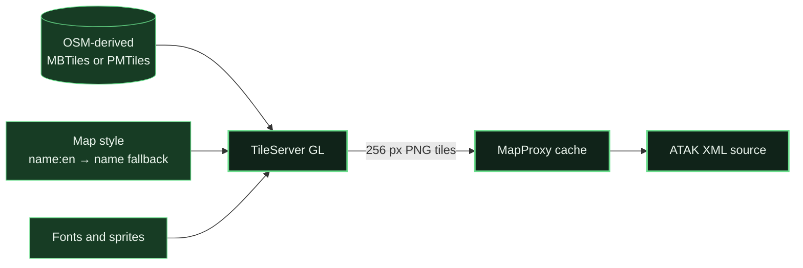

# Adding map layers

This guide explains how to extend ATAK MapProxy with another map source. Start
with a self-hosted XYZ source you control; external providers often require
provider-specific cache, attribution, authentication, and rate-limit settings.

## The four pieces of a layer

Every ATAK MapProxy layer has four related pieces:


| Piece | Where it lives | Purpose |
| --- | --- | --- |
| Upstream source | `templates/mapproxy.yaml.template` → `sources` | Describes where original imagery comes from. |
| Cache | `templates/mapproxy.yaml.template` → `caches` | Controls format, grid, persistence, and refresh behavior. |
| Layer | `templates/mapproxy.yaml.template` → `layers` | Gives MapProxy a public layer name. |
| ATAK XML | `templates/*.xml.template` | Tells ATAK which URL, zooms, and image type to use. |

The identifiers connecting these sections must match exactly.

## Before adding an external provider

Document these items first:

- official usage and caching policy;
- required attribution text and link;
- allowed client applications;
- whether a proxy is allowed;
- minimum and maximum cache lifetime;
- whether conditional requests are required;
- request rate and concurrency limits;
- authentication or API-key handling;
- supported zoom levels and geographic coverage; and
- whether offline download or prefetching is permitted.

Do not copy every URL from a map catalog into the proxy. Technical access is not
permission to cache or redistribute a provider's tiles.

## Example: add a self-hosted XYZ layer

This example assumes you operate a PNG XYZ tile server at:

```text
http://192.168.1.60:9000/{z}/{x}/{y}.png
```

The source is self-hosted so its cache policy is under your control. Replace all
example names, addresses, zoom levels, and attribution with values appropriate
for your service.

### 1. Add a MapProxy layer

Open `templates/mapproxy.yaml.template`. Add an item under `layers`:

```yaml
layers:
  - name: osm
    title: OpenStreetMap Standard - © OpenStreetMap contributors
    sources: [osm_attributed_cache_v2]

  - name: local_example
    title: Local Example Imagery
    sources: [local_example_cache]
```

`local_example` becomes part of the public tile URL. Use only lowercase letters,
numbers, and underscores for predictable URLs.

### 2. Add its cache

Add a cache under `caches`:

```yaml
caches:
  # Existing OSM cache remains here.

  local_example_cache:
    grids: [webmercator]
    sources: [local_example_source]
    format: image/png
    request_format: image/png
    meta_size: [1, 1]
    meta_buffer: 0
    refresh_before:
      days: 1
    cache:
      type: file
      directory_layout: tms
```

This example refreshes a viewed tile after one day. Choose a value that matches
the source you operate. Do not copy the OSM seven-day rule to an unrelated
provider without reviewing its policy.

If attribution must be rendered into the image, add:

```yaml
    watermark:
      text: "© Example Provider"
      opacity: 90
      font_size: 11
      color: '#202020'
```

### 3. Add the source

Add the source under `sources`:

```yaml
sources:
  # Existing OSM source remains here.

  local_example_source:
    type: tile
    grid: webmercator
    url: http://192.168.1.60:9000/%(z)s/%(x)s/%(y)s.png
    concurrent_requests: 4
    http:
      client_timeout: 30
```

MapProxy uses Python-style placeholders—`%(z)s`, `%(x)s`, and `%(y)s`—rather
than the braces commonly shown in provider documentation.

The source must be reachable from inside the MapProxy container. A LAN address
is usually clearer than `localhost`, because `localhost` inside a container
means that container itself.

### 4. Add an ATAK XML template

Create `templates/Local-Example.xml.template`:

```xml
<?xml version="1.0" encoding="UTF-8" standalone="yes"?>
<customMapSource>
    <name>Local Example Imagery</name>
    <minZoom>0</minZoom>
    <maxZoom>18</maxZoom>
    <tileType>png</tileType>
    <tileUpdate>IfNoneMatch</tileUpdate>
    <url>__PUBLIC_BASE_URL__/mapproxy/tiles/local_example/webmercator/{$z}/{$x}/{$y}.png</url>
    <backgroundColor>#000000</backgroundColor>
    <ignoreErrors>false</ignoreErrors>
    <serverParts></serverParts>
</customMapSource>
```

The URL segment `local_example` must match the MapProxy layer name. Match
`minZoom`, `maxZoom`, and `tileType` to the real source.

The Docker `configure` service renders every `templates/*.xml.template` file
into `runtime/`. The generated files remain ignored by Git.

### 5. Regenerate and restart

```bash
./scripts/configure.sh \
  192.168.1.50 https://maps.example.org/contact
docker compose up -d --force-recreate --wait
./scripts/validate.sh --live
```

The new XML is now available at:

```text
http://192.168.1.50:8080/sources/Local-Example.xml
```

Open that URL on the ATAK device, download the file, and import it. Additional
XML templates are served automatically; the default green page continues to
feature the OSM layer unless you also extend `templates/index.html.template`.

### 6. Test the layer before sharing it

Open one tile through the gateway:

```text
http://192.168.1.50:8080/mapproxy/tiles/local_example/webmercator/0/0/0.png
```

Then verify:

```bash
docker compose ps
./scripts/validate.sh --live
docker compose logs -f
```

Confirm the image renders, attribution is visible where required, repeat views
come from cache, and the upstream request volume matches the source policy.

## External XYZ/TMS providers

For an external provider, the source often needs additional HTTP headers:

```yaml
  provider_source:
    type: tile
    grid: webmercator
    url: https://tiles.example.net/%(z)s/%(x)s/%(y)s.png
    http:
      client_timeout: 30
      headers:
        User-Agent: "YourServiceName/1.0"
        Authorization: "Bearer ${PROVIDER_TOKEN}"
```

Do not commit credentials. MapProxy supports environment-variable expansion,
but adding secrets also requires passing them into the container through
Compose. Document the expected variable in `.env.example`, keep the real value
in ignored `.env`, and confirm it does not appear in generated files or logs.

The private nginx raw-response cache in this repository is deliberately scoped
to OpenStreetMap. Do not route another provider through it by changing only the
hostname; add a separate, provider-specific cache location and review header,
TTL, authentication, and cache-key behavior first.

## WMS and WMTS sources

WMS and WMTS are not simple XYZ URL substitutions.

For WMS, MapProxy needs the service URL, layer names, supported image format,
coordinate system, transparency behavior, and often a coverage. Start with the
official [MapProxy source documentation](https://mapproxy.github.io/mapproxy/latest/sources.html)
and the provider's GetCapabilities document.

For WMTS, confirm the tile matrix set, matrix identifiers, coordinate system,
origin, and row direction. A service using EPSG:4326 or a custom matrix cannot
be assumed to match the existing `webmercator` grid.

## JPEG layers

For JPEG imagery, change both MapProxy and ATAK values:

```yaml
format: image/jpeg
request_format: image/jpeg
```

```xml
<tileType>jpg</tileType>
<url>__PUBLIC_BASE_URL__/mapproxy/tiles/example/webmercator/{$z}/{$x}/{$y}.jpg</url>
```

Do not add a PNG extension to JPEG bytes; ATAK and intermediary caches rely on
the declared format.

## English-preferred labels from vector data

MapProxy cannot translate labels in an existing PNG or JPEG tile because the
text is already part of the image. An English-preferred map needs vector tile
data and a style that selects `name:en`, falling back to `name` when no English
value exists.

A self-hosted rendering path looks like this:



TileServer GL can read local MBTiles or PMTiles and expose rendered PNG, JPEG,
or WebP tile endpoints. Its full image-rendering build is required; the
`tileserver-gl-light` build does not render raster tiles. See the official
[TileServer GL configuration](https://tileserver.readthedocs.io/en/latest/config.html),
[rendered endpoint](https://tileserver.readthedocs.io/en/latest/endpoints.html#rendered-tiles),
and [OpenMapTiles language fields](https://openmaptiles.org/schema/) documentation.

The style expression should follow this logic:

```json
["coalesce", ["get", "name:en"], ["get", "name"]]
```

After the renderer works independently, add its PNG endpoint as a self-hosted
XYZ source using the procedure above. Keep the original data attribution in the
style and MapProxy layer. Vector storage is compact relative to a pre-rendered
multi-zoom raster archive, but rendering consumes CPU, memory, fonts, and style
assets; cache the rendered result for repeated field use.

## Layer checklist

Before committing a new layer:

- [ ] Provider terms and cache policy are linked in documentation.
- [ ] Attribution is correct and visible.
- [ ] Layer, cache, source, and XML identifiers match.
- [ ] Zoom range and tile format match the upstream.
- [ ] No API keys, private URLs, LAN addresses, generated XML, or QR images are
      tracked.
- [ ] `./scripts/validate.sh --live` passes.
- [ ] A fresh request renders and a repeat request uses cache.
- [ ] Offline download is disabled unless the provider explicitly permits it.

## Can this proxy every ATAK-Maps entry?

Not safely as a single automatic import. A catalog can contain XYZ, WMS, WMTS,
authenticated, rate-limited, non-cacheable, or restricted sources with
different attribution and licensing requirements. The architecture can host
many reviewed layers, but each source needs an explicit configuration and
policy decision.
