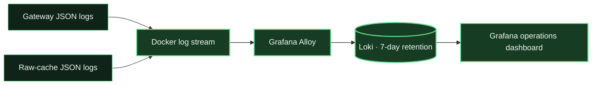

# Optional Grafana dashboard

The monitoring profile adds a local Grafana dashboard for event operations and
constrained links such as Starlink or other satellite backhaul. When many field
clients view the same area, the shared cache keeps repeat tile requests on the
LAN instead of sending every device across the uplink. The dashboard helps
answer two practical questions:

1. How much map demand is coming from LAN clients?
2. How often does that demand require an upstream request?

Monitoring is optional. A normal `make up` starts only the map services.

## Start monitoring

From the repository directory:

```bash
make monitoring-up
```

Open:

```text
http://127.0.0.1:3000/d/mapproxy-operations
```

Grafana is provisioned automatically. There is no setup wizard, datasource
configuration, or dashboard import.

Verify Grafana, the provisioned dashboard, Loki, and every dashboard query:

```bash
make monitoring-validate
```

[](assets/operations-dashboard.png)

The screenshot uses synthetic documentation-range client activity and
already-cached tiles; it contains no field-client addresses or event data.

## What starts

| Service | Purpose |
| --- | --- |
| Grafana | Displays the provisioned operations dashboard. |
| Loki | Stores and queries local request logs for seven days. |
| Grafana Alloy | Reads the gateway and cache container logs through Docker and sends them to Loki. |

These containers run only under the Compose `monitoring` profile.



## Dashboard panels

The dashboard is read from top to bottom during an event:

| Section | Operational question |
| --- | --- |
| Live pulse | Are clients requesting tiles right now, and is that demand reaching the uplink? |
| Efficiency | Over five minutes, how much repeat work stayed on the LAN? |
| Traffic and bandwidth | When did demand burst, and how much tile payload crossed each side? |
| Latency and reliability | Are clients waiting on the LAN, the upstream service, or failed responses? |
| Cache behavior | What happened after a rendered tile was not already available? |
| Client and map demand | Which addresses, layers, and zoom levels are creating demand? |
| Exceptions | Which recent requests failed or took more than one second? |

### Active client addresses

The number of distinct client IP addresses that requested tiles during the last
ten seconds. This is a practical estimate, not an authenticated ATAK session
count. Multiple devices behind one NAT address are counted as one; a device that
changes address can be counted twice.

Native Linux normally exposes the LAN source address through Docker's published
port. Docker Desktop on Windows forwards connections through its backend and
can replace every source with a bridge address such as `172.20.0.1`. Use the
documented `make windows-up` path from WSL to preserve client addresses through
the Windows-native forwarder.

### Tile requests from LAN

The number of tile responses requested through the gateway during the last ten
seconds. This represents client demand whether MapProxy answered from disk or
needed another cache layer.

### Requests sent upstream

The number of raw-cache outcomes indicating that the OSM service was contacted:

- `MISS`: no raw response existed;
- `EXPIRED`: the cached response had expired and was replaced;
- `REVALIDATED`: an expired response was conditionally checked;
- `STALE`: a stale response was used while the upstream was unavailable.

The live card uses the last ten seconds and counts request attempts, not only
full image downloads. A successful conditional request can contact OSM and
receive no new tile body.

### Tile data served to LAN

The HTTP response-body bytes sent for tile requests during the last ten seconds.
It excludes Ethernet, Wi-Fi, TCP, TLS, and VPN overhead.

### LAN requests versus uplink requests

The live chart compares request counts in discrete ten-second buckets. It does
not use a moving rate average, so a burst appears quickly and falls to zero
about ten seconds after requests stop. A widening gap indicates shared cache
reuse across clients.

### Estimated tile data kept off uplink

This subtracts observed upstream tile-body bytes from tile-body bytes served to
LAN clients over the same window. It is useful for comparing cache activity but
is not a modem-level measurement: MapProxy can re-encode tiles, and the value
excludes TCP, VPN, retransmission, and satellite-link overhead. Negative results
caused by representation differences are displayed as zero rather than claimed
as negative savings.

### Source-cache behavior

The source-cache hit-rate card is deliberately scoped to requests that were not
already satisfied by MapProxy's rendered-tile cache. A rendered-tile hit never
reaches the source cache, so it is not part of this percentage. If no requests
reached the source cache, the card says `No source-cache activity` instead of
showing a misleading zero or error.

The neighboring chart separates source-cache work into operational outcomes:

- `HIT`: the source tile stayed on the LAN;
- `MISS`: a new tile was fetched upstream;
- `EXPIRED` or `REVALIDATED`: an older entry was refreshed or checked upstream;
- `STALE`: an older entry was served after an upstream problem.

Use the five-minute `Estimated requests kept on LAN` card for overall cache
effectiveness. It includes the combined effect of both cache layers.

### Client and map demand

The client table uses a five-minute window to identify unusually active
addresses. Map-layer totals show which configured source is receiving demand.
The map-detail panel groups requests by zoom number: higher numbers mean more
detail and commonly require more unique tiles as users move around.

### Exceptions

The compact exception panel shows only failures and requests taking more than
one second. Full logs remain available with `make logs`.

## Why bandwidth savings are an estimate

The dashboard measures application-layer request and response bytes. It cannot
measure Starlink modem framing, TCP retransmissions, VPN overhead, radio link
conditions, or other traffic sharing the uplink.

The most reliable cache-effectiveness signal is the difference between LAN tile
request volume and upstream contact volume. The dashboard deliberately avoids a
single claim of exact dollars or bytes saved.

## LAN access

Grafana binds to `127.0.0.1` by default. This keeps client addresses and request
details visible only on the Docker host.

To view Grafana from another trusted LAN device, edit ignored `.env`:

```dotenv
GRAFANA_BIND_ADDRESS=0.0.0.0
GRAFANA_PORT=3000
```

Then recreate the monitoring services:

```bash
make monitoring-up
```

Open `http://DOCKER-HOST-LAN-IP:3000/d/mapproxy-operations`.

The provisioned instance permits anonymous viewing and disables the login form.
Do not expose it to the internet or an untrusted network. Put it behind an
authenticated TLS reverse proxy if broader access is required.

## Privacy and local storage

Monitoring records client IP addresses, request paths, response status, response
bytes, timing, and cache outcomes. It does not send data to Grafana Cloud or any
other hosted telemetry service.

- Loki retains queryable logs for seven days.
- Docker uses its size-limited local logging driver for gateway and raw-cache
  logs.
- Grafana, Loki, and Alloy state are kept in named Docker volumes.
- Alloy mounts the Docker socket read-only to discover and read the two service
  logs. Docker socket access is sensitive even when mounted read-only; enable
  the profile only on a trusted host.

## Stop monitoring

```bash
make monitoring-down
```

This stops Grafana, Loki, and Alloy without stopping the map gateway or deleting
monitoring data. Start them again with `make monitoring-up`.

Check their state with:

```bash
make monitoring-status
```

## Troubleshooting

### Grafana page does not open

```bash
make monitoring-status
docker compose --profile monitoring logs --tail=100 grafana loki alloy
```

Confirm port 3000 is free and that `.env` contains the intended bind address.

### Panels show no data

Request a few map tiles from ATAK or open a tile URL, wait up to ten seconds,
then refresh the dashboard. New logs must pass from Docker through Alloy to
Loki before they appear.

Check Alloy and Loki:

```bash
docker compose --profile monitoring logs --tail=100 alloy loki
```

### Recent clients appears lower than the device count

Devices behind a router, VPN, or proxy can share one source IP. The dashboard
counts observed addresses, not device identifiers, callsigns, or authenticated
users.
